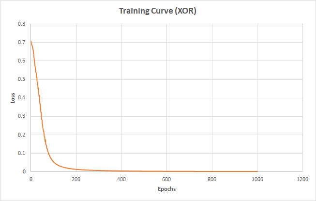
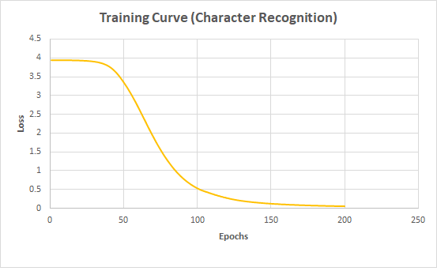
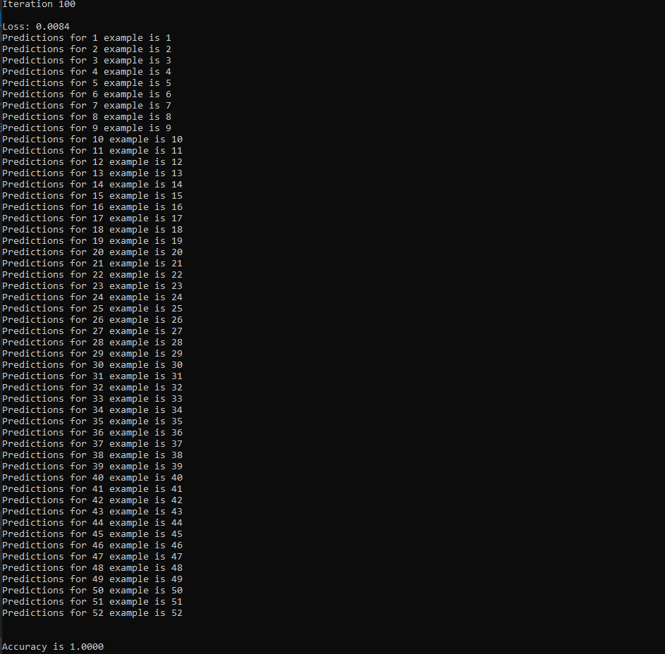
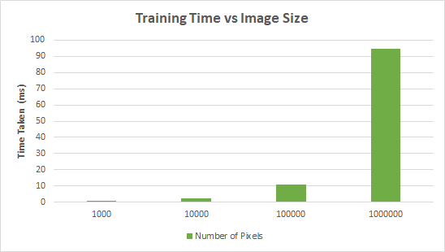
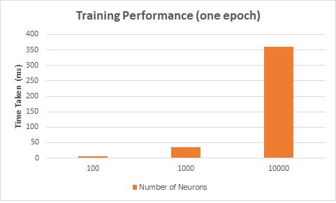

CUDA Character Recognition
======================

**University of Pennsylvania, CIS 565: GPU Programming and Architecture,
Project 2 - Character Recognition**

* Srinath Rajagopalan
  * [LinkedIn](https://www.linkedin.com/in/srinath-rajagopalan-07a43155), [twitter](https://twitter.com/srinath132)
* Tested on: Windows 10, i7-6700 @ 3.4GHz 16GB, Nvidia Quadro P1000 4GB (Moore 100B Lab)

### Neural Networks in CUDA for Character Recognition


   

In this we project, I have implemented a feedforward neural network, from scratch, in C++ and CUDA to make efficient use of the GPU to parallelize the matrix operations.

The network is trained to achieve a 100% accuracy on the provide character recognition dataset of 52 images with a resolution of 101x101. This network will NOT generalize to unseen test samples and that is not the focus of this project. The focus is on the performance and scalability comparisons and appreciating the role of the GPU.

The network architecture is fixed to have one hidden layer but one can configure the image size, number of images, and the number of hidden neurons. 

## Computation Graph

The setup is a 2-layer neural network with the following configuration
* Input - `X` of dimension `52 x 10201`
* Hidden - `X2` of dimension `52 x 10` with `ReLU` non-linearity and `10` hidden neurons
* Output - `probs` of dimension `52x52` predicted probability for each sample over 52 classes

In effectively 2 matrix multiply operations, we compute the predictions for ALL `N` examples at the same time. It is helpful to think of the operations being performed on the matrices themselves and utilizing matrix differentiation to calculate the gradients for the backward pass. 

The following Python-Numpy, borrowed from [CS231n: CNNs for Visual Recognition](https://cs231n.github.io/neural-networks-case-study/), illustrates how we can vectorize the forward pass and backward pass computation.

```
### Forward Pass
# evaluate class scores with a 2-layer Neural Network
hidden_layer = np.maximum(0, np.dot(X, W) + b) # note, ReLU activation
scores = np.dot(hidden_layer, W2) + b2
exp_scores = np.exp(scores)
probs = exp_scores / np.sum(exp_scores, axis=1, keepdims=True)

### Evaluate Loss
correct_logprobs = -np.log(probs[range(num_examples),y])
data_loss = np.sum(correct_logprobs)/num_examples


### Backward Pass
dscores = probs
dscores[range(num_examples),y] -= 1
dscores /= num_examples # derivative wrt output layer

dW2 = np.dot(hidden_layer.T, dscores) # derivative wrt W2
db2 = np.sum(dscores, axis=0, keepdims=True) 

dhidden = np.dot(dscores, W2.T) # derivative wrt hidden layer
dhidden[hidden_layer <= 0] = 0 # derivative through ReLU 

dW = np.dot(X.T, dhidden) # derivative wrt W
db = np.sum(dhidden, axis=0, keepdims=True)
```

The above code is treated as an API one can adhere to. It's easy to see how easily all the above operations can be individually parallelized. To achieve this the following CUDA Kernels have been implemented

* Matrix multiply on any two matrices of any size
* Slicing operations to fetch the scores of the correct class for each example
* ReLU activation 
* Softmax activation
* Matrix addition
* Element-wise matrix multiplication
* Filter to zero-out negative elements in a matrix

## Training Curves

The training curve is plotted for the toy XOR operation and for the character recognition dataset.






Predictions on character-recognition is given below



## Performance Analysis on Memorizing Random Images

With 52 examples, and enough number of hidden neurons, we can achieve 100% accuracy on random images (101x101 resolution)! 


The performance analysis is based on generating random images of different resolutions (changing `d`) and different number of hidden neurons (changing `h`)






## Extra Credit
The forward and backward pass is computed for all `N` exmaples simultaneously in one-shot using matrix-multiply and slicing operations.


