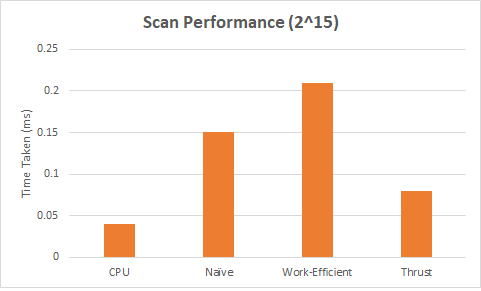
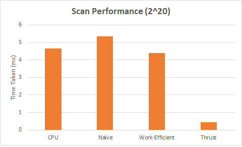
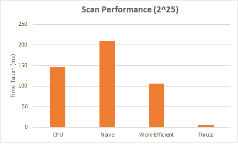
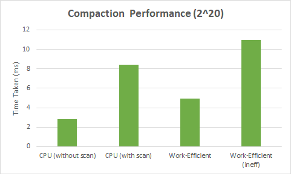
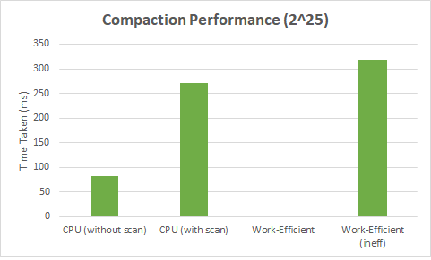

CUDA Stream Compaction
======================

**University of Pennsylvania, CIS 565: GPU Programming and Architecture,
Project 2 - Stream Compaction**

* Srinath Rajagopalan
  * [LinkedIn](https://www.linkedin.com/in/srinath-rajagopalan-07a43155), [twitter](https://twitter.com/srinath132)
* Tested on: Windows 10, i7-6700 @ 3.4GHz 16GB, Nvidia Quadro P1000 4GB (Moore 100B Lab)

### Scan and Stream Compaction

In this we project, I have implemented the exclusive scan and stream compaction algorithms for different configuratins 
1) CPU scan and CPU stream compaction
2) Naive GPU scan
3) Work-Efficient GPU scan and stream compaction
5) Scan from Thrust (to benchmark)

Scan and Compaction can be best understood with the following example:

* scan: 
  - goal: produce a prefix sum array of a given array (we only care about exclusive scan here)
  - input
    - [1 5 0 1 2 0 3]
  - output
    - [0 1 6 6 7 9 9]
* compact: 
  - goal: closely and neatly packed the elements != 0
  - input
    - [1 5 0 1 2 0 3]
  - output
    - [1 5 1 2 3]

## GPU Implementation
### Naive Scan
Though exclusive scan looks like a sequential operation, we can parallelize by dividing the computation to `log(n)` passes through the array. In the first pass, we do `a[i] = a[i] + a[i-1]`. The invariant we maintain is that by the `k`th pass, we have the correct values in the array upto to the index `2^(k-1)` (excluded), and we perform the two-sum addition only for `index >= 2^(k-1)`. After `log(n)` passes, the array will contain an inclsuive scan which we convert to exclusive by a shift-right operation. By utilizing `n` threads, each pass requires `O(1)` time and we have `log(n)` passes. So totally the time complexity is `O(log(n))`. However, what about the total number of adds? A sequential scan will only perform `n` adds. The naive parallel implementation odes `O(n)` adds for each pass and total number of adds is therefore `O(nlogn)`.

### Work-efficient Scan
Work-efficient implementation aims to bring down the total number of addition operations to `O(n)`. This approach uses a balanced-binary tree view to structure the computation. In the up-sweep phase, we go from the leaf nodes to the root and keep building partial-sums in-place. In the down-sweep phase, we traverse back from the root to make use of the partial-sum from before and build the scan in-place. This approach requires the array to be a power of 2, so when the array size is not one we pad it to the next 2-power. 

### Work-efficient Compaction

In compaction, we to remove all elements from the array which do not satisfy a certain criterion. We first create a boolean array indicating which all elements satisfy the criteria. After this, we call the work-efficient scan on the _boolean array_ to build the prefix-sum. For all the elements which are going to be included in the final array, the exclusive scan gives at what _index_ they must be writtten to. This is done by a parallel scatter operation. 


### Performance Analysis
1) A block size that worked well for each of the configurations was `128`. I experimented with different size options from 256 to 512 and the performance remained similar. Decreasing the block size below `64` led to a drop in performance for all the GPU implementations. Thus, all the comparisons  are benchmarked by fixing block size as 128.

2) Performannce graphs comparing the differnet implementations are included below. For work-efficient compaction, I implemented two versions, one of which is inefficient but passes all the test cases for array sizes upto 2^25. This implementation calls the work-efficient scan function implemented as a part of the scan setup. But to stick to the API, it also does several `cudaMemcpy` from device to host and host to device which is not required if the interemediate scan buffers are never going to be needed on the CPU. However, the more efficient version is not passing the test case for not-power of two for array size `2^25`. 


	

	

	


	

	

	


*What do the above graphs mean?*

For smaller inputs, the CPU implementation is significantly faster than the GPU one. The GPU naive scan invokes a kernel `log(n)` times. There is a lot of overhead incurred while invoking a kernel withtin a loop. For small sizes it doesn't justify the cost. The overhead is compounded in  work-efficient scan.  So for small array sizes we are better off with the CPU. However, the CPU scan _also_ performs better than the naive one for large array sizes. Why? I am theorizing this to be because of the additional number of adds required in the parallel approach. This is also reflected in the fact that the the work-efficient scan is faster than the CPU implementation for the larger array size. Thrust, unsurprisingly, performs better than everything I have implemented. This is probably because, though the algorithmic complexity might still be the same, Thrust is making better utilizattion of hardware resources: using shared memory and reducing global memory calls, and also avoiding issues like bank conflicts (when accessing shared memory).

Work-efficient compaction is significantly slower if use the same implementation as work-efficient scan one. This is because of additional `cudaMemcpy` calls from Host to Device and Device to Host. We can improve this by minimizing the CPU-GPU transfers by maintaining all the intermediate arrays in the GPU itself. But scan updates the array in place and we require the boolean array while performing scatter, so we have to copy it to another memory location on the GPU. This is a better alternative compared as it's a Device to Device transfer as opposed tot Device To Host.

### Tests output

```
****************
** SCAN TESTS **
****************
    [   8  18  36  48  30   4   0  24  16  19  40  47  23 ...  23   0 ]
==== cpu scan, power-of-two ====
   elapsed time: 0.0017ms    (std::chrono Measured)
    [   0   8  26  62 110 140 144 144 168 184 203 243 290 ... 25535 25558 ]
==== cpu scan, non-power-of-two ====
   elapsed time: 0.0016ms    (std::chrono Measured)
    [   0   8  26  62 110 140 144 144 168 184 203 243 290 ... 25468 25509 ]
    passed
==== naive scan, power-of-two ====
   elapsed time: 0.251904ms    (CUDA Measured)
    passed
==== naive scan, non-power-of-two ====
   elapsed time: 0.058368ms    (CUDA Measured)
    passed
==== work-efficient scan, power-of-two ====
   elapsed time: 0.099328ms    (CUDA Measured)
    passed
==== work-efficient scan, non-power-of-two ====
   elapsed time: 0.142368ms    (CUDA Measured)
    passed
==== thrust scan, power-of-two ====
   elapsed time: 0.05264ms    (CUDA Measured)
    passed
==== thrust scan, non-power-of-two ====
   elapsed time: 0.082112ms    (CUDA Measured)
    passed

*****************************
** STREAM COMPACTION TESTS **
*****************************
    [   2   2   2   2   0   0   0   2   0   1   0   3   3 ...   1   0 ]
==== cpu compact without scan, power-of-two ====
   elapsed time: 0.0026ms    (std::chrono Measured)
    [   2   2   2   2   2   1   3   3   2   2   1   3   2 ...   1   1 ]
    passed
==== cpu compact without scan, non-power-of-two ====
   elapsed time: 0.0164ms    (std::chrono Measured)
    [   2   2   2   2   2   1   3   3   2   2   1   3   2 ...   3   1 ]
    passed
==== cpu compact with scan ====
   elapsed time: 0.124ms    (std::chrono Measured)
    [   2   2   2   2   2   1   3   3   2   2   1   3   2 ...   1   1 ]
    passed
==== work-efficient compact, power-of-two ====
   elapsed time: 0.459776ms    (CUDA Measured)
    passed
==== work-efficient compact, non-power-of-two ====
   elapsed time: 0.529408ms    (CUDA Measured)
    passed```

